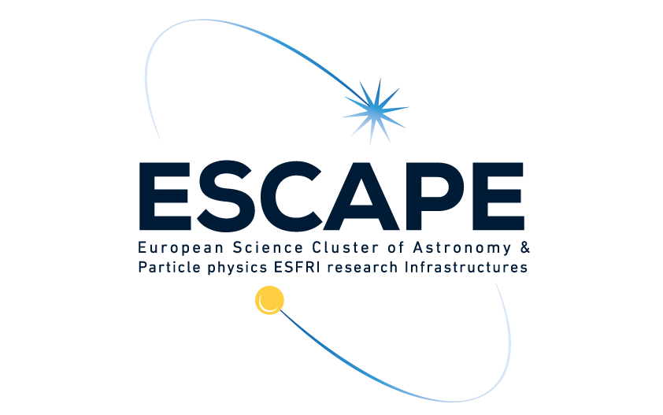

# ESCAPE Summer School, June 2021

Lecture **"Introduction to the Scikit-HEP Big Data Python ecosystem for analysis in Particle Physics"** for the
[ESCAPE Summer School on Data Science for Astronomers, Astroparticle and Particle Physics](https://indico.in2p3.fr/event/20306/) held as a virtual event on 7-18 June 2021.

---

<table>
<tr>
    <td>
    <b><span style="color:blue">
    The School is organized in the framework and with the support of the European Science Cluster of Astronomy
    &amp; Particle physics ESFRI research infrastructures (ESCAPE),
    funded by the European Union's Horizon 2020 - Grant N. 824064.
    </span></b>
    </td>
</tr>
<tr>
    <td align="center"></td>
</tr>
</table>

---

### Abstract

Data analysis in High Energy Physics (HEP) has evolved considerably in recent years. In particular, the role of Python has gained much momentum, sharing at present the show with C++ as a language of choice.
Several (community) domain-specific projects have seen the day, providing (HEP) data analysis packages that profit from, and talk to well with, the huge Python scientific ecosystem, which navigates around NumPy and friends.
This lecture introduces the Scikit-HEP project, which I started in late 2016 with a few colleagues from various backgrounds
and domains of expertise.
Scikit-HEP is a community-driven and community-oriented project with the aim of providing Particle Physics at large
with a Big Data ecosystem for analysis in Python. It has developed considerably in the past couple of years,
and is now part of the official software stack of the experiments ATLAS, Belle II, CMS and KM3NeT.
In this lecture ample time will be provided to "play around" with the material, in Jupyter notebooks.


## Setup

These lectures come with a dedicated environment file for conda. You can set yourself up locally following the same approach as explained under section https://github.com/escape2020/school2021/blob/main/README.md#setup-the-conda-environment.


(As for the other lectures you may use only conda replacing `mamba` commands with `conda`.)

```bash
cd school2021
conda install mamba -n base -c conda-forge  # not needed if done already
mamba env create -f scikit-hep/environment.yml
conda activate eschool2021_skhep
```

### Installation-free run

One can straightforwardly run this notebook presentation on Binder, with no installation requirements on the user side
(Be aware that the environment to set up is relatively large and it may take about 5 minutes for the notebooks to be up
and running online.)

Just click on

<p align="center">
  <a href="https://mybinder.org/v2/gh/eduardo-rodrigues/2021-06-14_ESCAPESummerSchool/master/?urlpath=lab">
    
  </a>
</p>

The same tutorial is accessible at https://github.com/eduardo-rodrigues/2021-06-14_ESCAPESummerSchool,
which in fact is used above for Binder.

Anything can be altered along the way.
