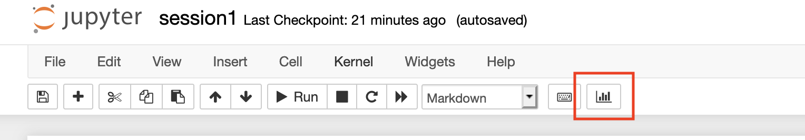

# ESCAPE data science summer school 2021: Apache Spark

Welcome to the Apache Spark lecture! Please, read carefuly this page before starting the lecture as it contains important information to set up the materials. 

1. [Goals of the lecture](#goals-of-the-lecture)
2. [Timetable](#timetable)
3. [Pre-requisites](#pre-requisite)
4. [How to play the exercices?](#how-to-play-the-exercices)
5. [Note for Windows users](#note-for-windows-users)
6. [Alternative to Docker for notebooks: Google Colab](alternative-to-docker-for-notebooks-google-colab)

## Goals of the lecture

*  Learning the basics of cluster computing, and the big data challenges in modern science.
- Learning how to integrate scientific tools into [Apache Spark](https://spark.apache.org/), and how to perform efficient analysis on large volumes of data.

## Timetable

### Session 1

I will review the landscape of cluster computing by addressing some of the most pressing questions today: what is cluster computing? What does it mean working in a distributed environment? What are the data and computing challenges that the scientific community is facing nowadays, and how can we tackle those? Some useful concepts like functional programming and implicit parallelisation will be discussed. I will also introduce Apache Spark, a cluster computing framework for analysing large datasets that proved successful in the industry. I will specifically focus on the Apache Spark SQL module and DataFrames API, and we will start practicing through a series of simple exercises.

### Session 2

In this session, we will use the Apache Spark Python API (PySpark) and learn on concrete examples how to interface and play with popular scientific libraries (Numpy, Pandas, ...). We will also see how to test and debug a code written with Spark, and integrate it in a Continuous Integration pipeline.

### Session 3

For the last session, we will finish with concrete applications in the domain of astronomy: catalog & image manipulation, machine learning and streaming data (if time permits).

## Pre-requisites

- Latest version of [Docker](https://docs.docker.com/get-docker/) installed. In case you do not have it, all the exercises will be also accessible from Google Colab - but you will need a Google account.
- A good knowledge in Python
- Some general knowledge on parallel computing, and its challenges
- Some knowledge in functional programming can help.


## How to play the exercices?

As Spark needs a specific environment, the best way is to use Docker. We provide a Dockerfile in the repo to build the image. From the `spark/` folder of the school repository, execute the build script:

```bash
./build_image.sh
```

The first time, it will download the `jupyter/pyspark-notebook:spark-3.1.1` image (1.2GB compressed, ~3.5GB uncompressed on disk), and install the necessary dependencies. It will also perform a test of the installation by printing some information at the end:

```bash
Spark configuration
-------------------

3.1.1
[('spark.driver.extraJavaOptions', '-
Dio.netty.tryReflectionSetAccessible=true'), ('spark.driver.port', '43877'), 
('spark.rdd.compress', 'True'), ('spark.app.id', 'local-1623240222927'), 
('spark.app.name', 'test_installation.py'), 
('spark.serializer.objectStreamReset', '100'), ('spark.master', 'local[*]'), 
('spark.submit.pyFiles', ''), ('spark.executor.id', 'driver'), 
('spark.submit.deployMode', 'client'), ('spark.executor.extraJavaOptions', '-
Dio.netty.tryReflectionSetAccessible=true'), ('spark.app.startTime', 
'1623240220900'), ('spark.driver.host', '745599cb378c')]
Reading some data...
Configuration OK!


Python configuration
--------------------

3.9.4 | packaged by conda-forge | (default, May 10 2021, 22:13:33)
[GCC 9.3.0]


Jupyter RISE add-ons
--------------------

{'scroll': 'true', 'enable_chalkboard': 'true'}
```

### Launching notebooks

Use the provided runner to launch notebooks from the inside of the container:

```bash
./launch_notebooks.sh
...
[I 06:51:48.032 NotebookApp] Serving notebooks from local directory: /home/jovyan/work
[I 06:51:48.032 NotebookApp] Jupyter Notebook 6.4.0 is running at:
[I 06:51:48.032 NotebookApp] http://68a9631126c6:8888/?token=c9d4b1cb3774293f9dc87d49f92ea0dfc785bdf924fe53eb
[I 06:51:48.033 NotebookApp]  or http://127.0.0.1:8888/?token=c9d4b1cb3774293f9dc87d49f92ea0dfc785bdf924fe53eb
```

Copy the generated URL in your browser tab, and walk to the notebook folder. Then open a notebook to play it. Note that you can either directly run the notebook as is, or play it as slides using the [RISE](https://rise.readthedocs.io/en/stable/) button (use SPACE to move between slides):



### Entering the container

To enter the container and fully enjoy all Spark features, you would just use the provided runner:

```bash
./launch_container.sh
(base) jovyan@77081e01d859:~/work$

```

From here, you can launch any regular Spark job. For example, try:

```bash
spark-submit --master local[*] test_installation.py
```

### Data for mini-projects

The last session will show case real-life analysis using Apache Spark. The dataset, although not very big, are too big to be stored in the repository. In order to get the data, just use the runner:

```bash
# In a Unix shell, ~200MB will be downloaded
./download_data_project.sh
```

## Note for Windows users

The bash scripts are mostly here to ease the ... by abstracting a number of commands. However, you can open each script, and just copy/paste the command in your Windows shell. It should work (almost) as-is. If you encounter trouble, just open a ticket in the [bug tracker](https://github.com/escape2020/school2021/issues).

## Alternative to Docker for notebooks: Google Colab

If you do not have Docker, or you do not want to use it, you can also play the notebooks directly in Colab: []()

Note you will need a Google account.